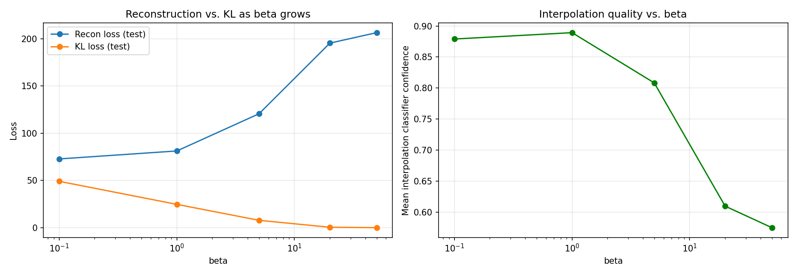
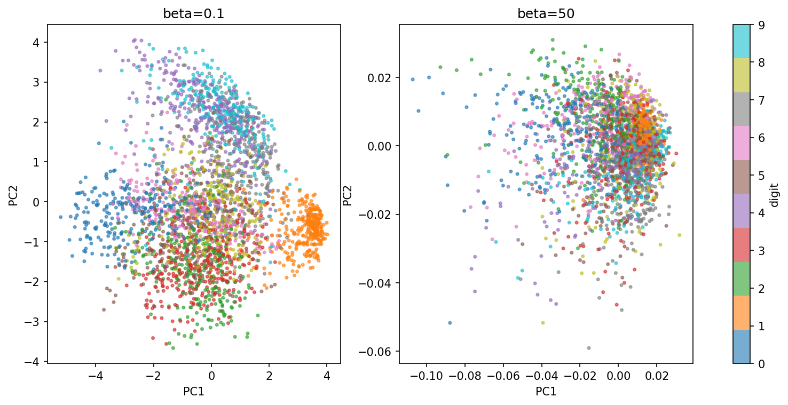
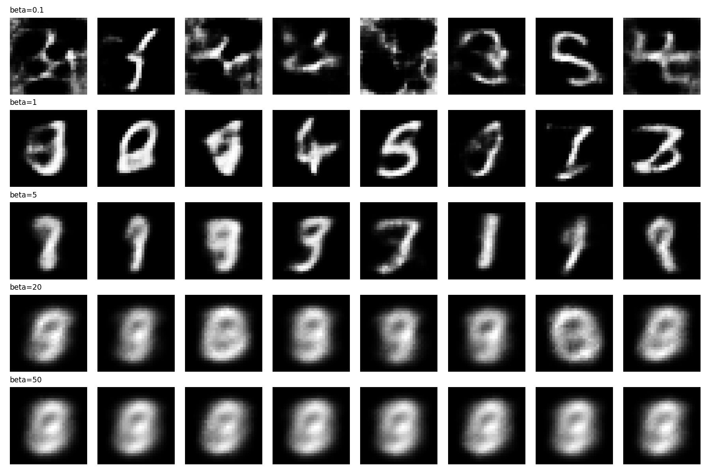
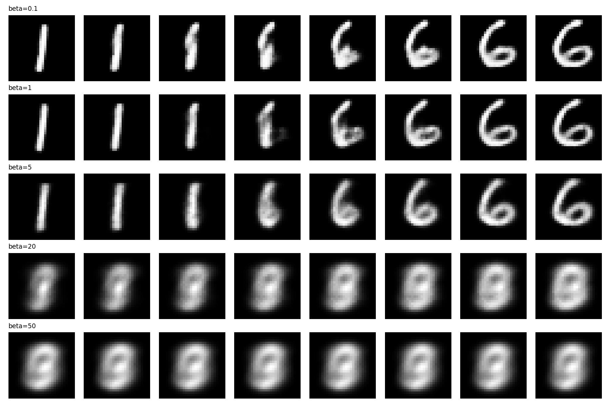

# Generative Modeling and Latent-Space Exploration (beta-VAE Trade-off Study)

## 1. Problem & Data

The task is to train a variational autoencoder, generate new samples, interpolate between
encodings, and explore the structure of the learned latent space. I used MNIST for this. It's simple
enough to iterate on quickly, and with visually distinct digit classes that make it easy to judge
qualitatively whether a generated or interpolated image "looks like a digit" or not, which turned
out to matter a lot for how I evaluated the contribution below.

## 2. Method

I used a fixed convolutional VAE architecture throughout (16-dimensional latent space, two conv
layers in the encoder, mirrored transposed convolutions in the decoder) trained with the standard
VAE loss: reconstruction (binary cross-entropy) plus a KL divergence term pulling the latent
distribution toward a standard Gaussian prior.

## 3. Original Contribution

Rather than just training one VAE and showing some samples, I trained the *same* architecture at
five different KL weights (beta = 0.1, 1, 5, 20, 50). Everything else held fixed, and measured
what changes as beta increases.

My hypothesis was that increasing beta would compact the latent space toward the prior, making
it more organized and interpolation between digits smoother and more meaningful, but at the cost
of reconstruction quality — with a sweet spot somewhere in the middle, since too high a beta
should eventually cause the model to start ignoring the input almost entirely (posterior
collapse).

To measure interpolation quality quantitatively rather than just eyeballing it, I trained a small
independent classifier on MNIST (not part of the VAE, purely a scoring tool — it got 98.0% test
accuracy, which is enough to trust its confidence as a signal). For 50 pairs of test digits from
different classes, I linearly interpolated between their latent encodings, decoded each
intermediate point, and recorded the classifier's confidence on it. Averaging that across all
pairs and interpolation steps gives one interpolation-quality number per beta.

## 4. Experiments

All five VAEs were trained on the same MNIST train/val split (55,000/5,000) with the same seed
and architecture, differing only in beta, with early stopping on validation loss. For each, I
recorded test-set reconstruction loss and KL loss separately (not just the combined ELBO, since
the whole point is to see how they trade off against each other), the interpolation-confidence
score described above, and PCA projections of the latent space for the lowest and highest beta,
colored by digit label.

## 5. Results & Analysis

| beta | Recon loss | KL loss | Interpolation confidence |
|---|---|---|---|
| 0.1 | 72.75 | 49.06 | 0.879 |
| 1 | 81.18 | 24.69 | **0.889** |
| 5 | 120.55 | 7.79 | 0.808 |
| 20 | 195.27 | 0.47 | 0.609 |
| 50 | 206.35 | 0.00 | 0.574 |

*Figure 1: Reconstruction and KL loss vs. beta (left), mean interpolation-confidence score vs.
beta (right).*

Figure 1 confirms the trade-off half of the hypothesis cleanly: reconstruction loss rises
monotonically with beta, KL loss falls monotonically, exactly as expected. What's more
interesting is the right panel — interpolation confidence is *not* monotonic. It peaks at
beta=1, not at the lowest beta tested, then drops steadily and falls off a cliff between beta=5
and beta=20. So the hypothesis was directionally right (there is a sweet spot) but wrong about
where the harm at low beta comes from — I expected interpolation quality to keep improving as
beta decreased toward 0, and instead beta=0.1 is already slightly worse than beta=1.

*Figure 2: 2D PCA projection of the latent space (colored by digit), beta=0.1 (left) vs.
beta=50 (right).*

Figure 2 is where the real story shows up. At beta=0.1, there's real digit-cluster structure
visible in the PCA projection — you can see distinct colored regions, and the axis range spans
about 8 units. At beta=50, there's no structure left at all — colors are completely mixed
together, and critically, the axis range has shrunk to about 0.02-0.03 units. That's not "a more
organized latent space," that's the encoder collapsing to nearly a single point regardless of
input. KL loss hitting essentially 0.00 at beta=50 is the same signal in numeric form: the
encoder has stopped encoding any input-dependent information at all.

*Figure 3: Samples decoded directly from the prior N(0, I), for each beta.*

Figure 3 makes the collapse even more obvious from a different angle. At beta=1 and beta=5, prior
samples are genuinely varied and mostly recognizable as different digits. At beta=20, they're
blurry but still show some shape variation. At beta=50, all eight samples in the row are nearly
identical — the same generic blurry blob repeated regardless of which random z was sampled. This
is a decoder that has learned to ignore its input almost entirely and just output an "average
digit."

*Figure 4: Interpolation between a "1" encoding and a "6" encoding, across beta.*

Figure 4 explains why beta=0.1 underperforms beta=1 on interpolation despite having *more*
freedom (lower KL pressure), which is the part of the hypothesis I got backwards. At beta=0.1,
the first few interpolation frames are visibly noisy/garbled (not clean digit shapes at all)
before settling into a recognizable "6" partway through. At beta=1, the same interpolation path
is clean at every step. My original reasoning was "less KL pressure = more freedom = better,"
but what's actually happening is closer to the opposite: too little KL regularization leaves
gaps or "holes" in the latent space that the decoder never learned to handle well, and an
interpolation path can wander through one of those holes and produce garbage. Beta=1 adds just
enough pressure to smooth the space out without yet causing collapse. At beta=5, interpolation
frames are still recognizable but visibly blurrier. At beta=20 and beta=50, the frames barely
change from one to the next — consistent with the collapse shown in Figures 2 and 3.

## 6. Discussion & Observation

**1. Why does interpolation work smoothly in a VAE but often produce garbage in a plain
autoencoder? What is the KL term doing to the geometry of the latent space?**

Based on what I saw across beta=0.1 through beta=50, I'd describe it this way: a plain
autoencoder has no pressure at all pushing its latent codes into any particular shape, it will
happily carve out disconnected regions or leave gaps wherever it's convenient for
reconstruction, since nothing in the loss penalizes that. The KL term in a VAE penalizes the
encoder's output distribution for straying from a shared, smooth N(0, I) prior, which forces
different encodings to sit close together in a continuous, overlapping way rather than in
isolated pockets. My beta=0.1 result is actually a nice illustration of what happens when this
pressure is too weak: Figure 4 shows visible garbling early in the interpolation path, which
looks a lot like exactly the "holes in the latent space" problem a plain autoencoder would have
even more of, since a plain autoencoder has zero KL pressure at all. At the same time, the KL
term can't be arbitrarily strong either — Figures 2 and 3 show that past a certain point (beta=20
and up here) it stops being "helpful organization" and starts being "the encoder gives up
entirely." So the honest answer is that the KL term doesn't straightforwardly make interpolation
better as it increases but it creates a real trade-off with a genuine middle-ground optimum,
bounded on both sides.

**2. If you replaced the Gaussian prior with something else (a mixture, or a uniform ball), how
would sampling and the shape of the latent space change, and what might break?**

I didn't implement this, but reasoning from what I observed: MNIST has genuinely clustered
structure (10 discrete digit classes), and a single Gaussian prior doesn't reflect that. It
assumes one smooth, unimodal blob, which is part of why even my best beta=1 latent space still
showed digit clusters blending into each other in the PCA plot rather than forming fully
separated islands. A mixture-of-Gaussians prior (e.g. one component per digit) seems like it
would match this structure better and might produce a latent space with cleaner separation
between classes. The likely cost is on the training side: computing (or approximating) KL
divergence against a mixture prior is harder than the closed-form Gaussian KL I used here, and
you'd probably need some way to encourage each encoded point toward the *right* mixture
component rather than an arbitrary one, which starts to resemble a conditional/class-aware VAE
rather than a purely unsupervised one. A uniform-ball prior, on the other hand, would remove the
density gradient toward the center that Gaussian sampling gives you. Under a Gaussian, points
near the origin are far more likely to be sampled than points near the tails, and my beta=50
results suggest what happens when a model collapses toward exactly that high-density region (it
just outputs the "average" digit). Without that gradient, I'd expect prior samples to be more
uniformly spread across the space, which could mean more diverse generations, but also a higher
chance of landing in a region near the edge of the ball that the decoder never learned to handle
well during training — plausibly a different flavor of the same "holes in the latent space"
problem I saw at low beta here.

## 7. Limitations & Next Steps

I only tested five beta values and a single architecture/bottleneck size, and only on MNIST,
which is a fairly easy, low-resolution dataset with clean class separation. I'd expect the
sweet-spot beta value to shift on a harder dataset like Fashion-MNIST or CelebA, and it would be
worth checking whether the same "beta=0.1 underperforms beta=1" pattern holds there too, or
whether it's specific to how clustered MNIST's classes are. The interpolation-confidence metric
also has a blind spot: it only tells me whether an interpolated image looks like *some* digit
with high confidence, not whether the interpolation path is smooth or semantically sensible along
the way — a metric based on frame-to-frame similarity, or a proper FID-style score as the
handbook's stretch goal suggests, would give a more complete picture. I'd also want to run each
beta at a couple of different seeds before treating the exact location of the peak (beta=1 rather
than, say, beta=0.5 or beta=2) as precise rather than approximate.
